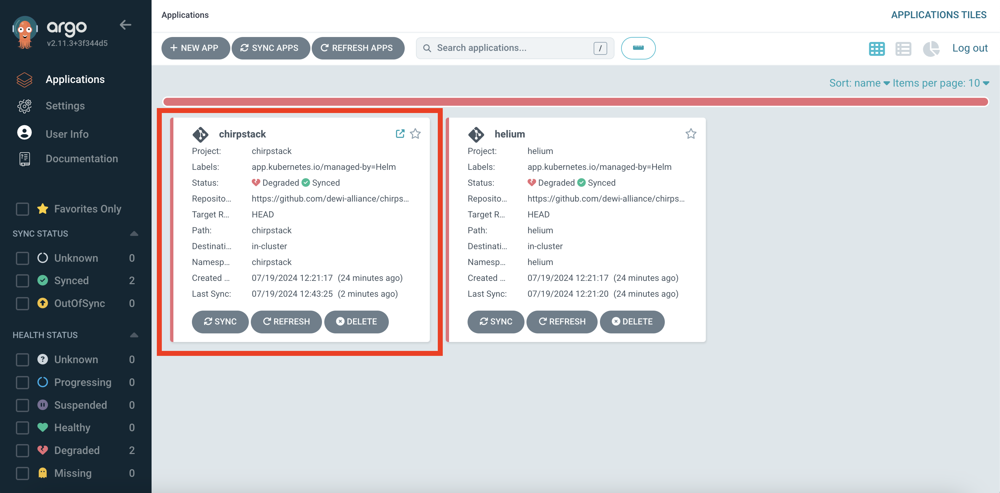
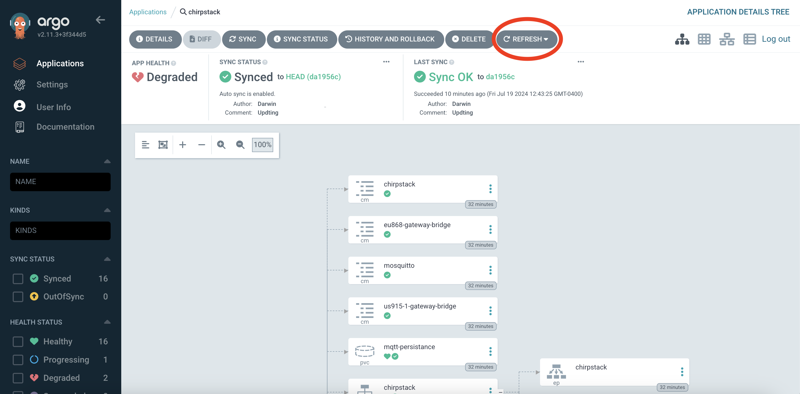
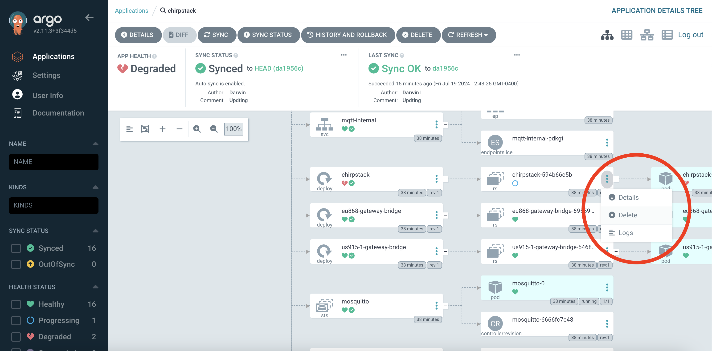

# Chirpstack

This directory contains a set of Helm charts for deploying Chirpstack and related applications in the EKS cluster. In particular, this directory includes Helm charts for:

- [Chirpstack V4](https://www.chirpstack.io/docs/chirpstack/configuration.html)
- [Chirpstack Gateway Bridge](https://www.chirpstack.io/docs/chirpstack-gateway-bridge/configuration.html)
- [Eclipse Mosquitto](https://mosquitto.org/)

## Usage

The state of the cluster was very sad as we left `./kubernetes` but after a few painless configuration changes Chirpstack will be up and running.

### Prerequisites

1. Update `values.yaml` with values and configuration for the deployment
2. Create `pwfile` for MQTT access
  a. In Secrets Manager, access `chirpstack/mqtt-credentials`
  b. On local device, create a file named `pwfile`
  c. In the same directory as `pwfile`, run `mosquitto_passwd -b pwfile <user> <password>`, where `<user>` and `<password>` are from `chirpstack/mqtt-credentials`
  d. Create a plaintext Secrets Manager secret titled `chirpstack/mqtt-pwfile` with the contents of `pwfile`

### Deployment

1. `git commit` the changes to `values.yaml`. Argo will catch these changes and update the cluster.

### Postrequisites

Everything is now in order for the Chirpstack application to be happily deployed, but it will take some further massaging to get there.

1. Navigate to Argo in your browser at <argo.example.com> (where <argo.example.com> is replaced with the domain provided via the `argo_url` variable in `./kubernetes`) and log in using the credentials stored in Secrets Manager at `root/argocd-admin-credentials`
2. Click the Chirpstack application, as shown in the red box in the image below.

3. In the Chirpstack application, it is likely that the `mqtt-secrets` ExternalSecret and `chirpstack` Ingress need to be refreshed. To do so, click the refresh button, as shown in the red circle in the image below, to ensure the latest commit is deployed from the forked Git Repo. After the refresh, `mqtt-secrets` ExternalSecret and `chirpstack` Ingress should become healthy. 

4. Force a new `chirpstack` ReplicaSet by clicking the three vertical dots in the `chiprstack` ReplicaSet grouping and selecting delete, as shown in the red circle in the image below. After doing so, a new `chiprstack` ReplicaSet will be created and the underlying `chiprstack` pod will deploy and eventually become healthy.

5. Force a new `mosquitto` pod by clicking the three vertical dots in the `mosquitto` pod and selecting delete, similar to step 4 above.

### Post Deployment Notes

At this point, the Chirpstack application will be healthy. Onto making `./helium` happy to close out the deployment!
