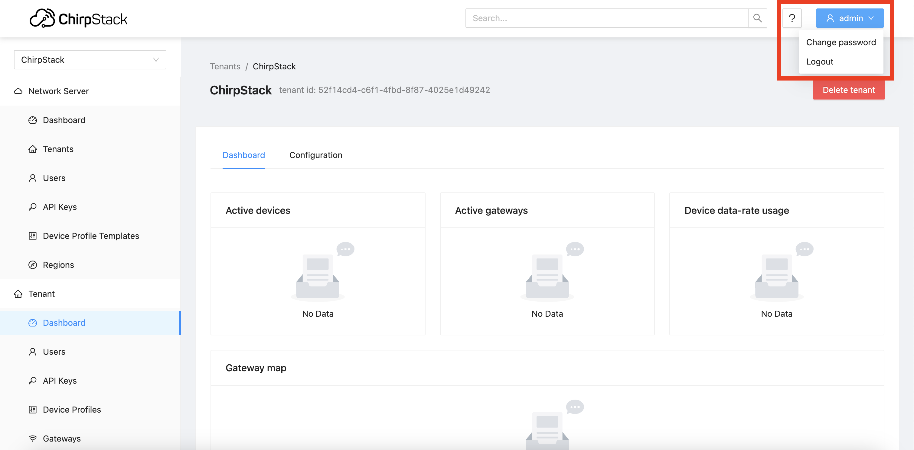
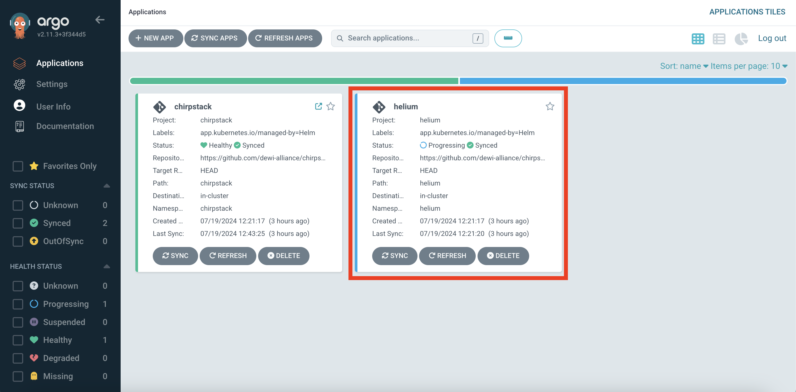
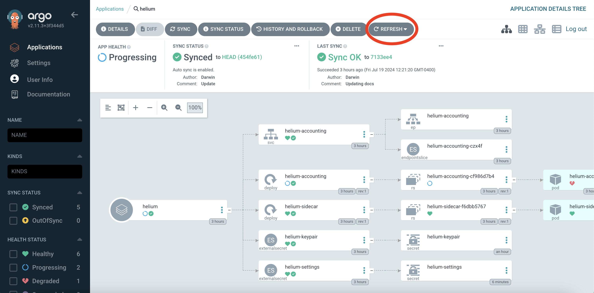
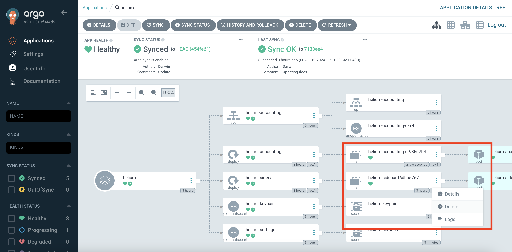
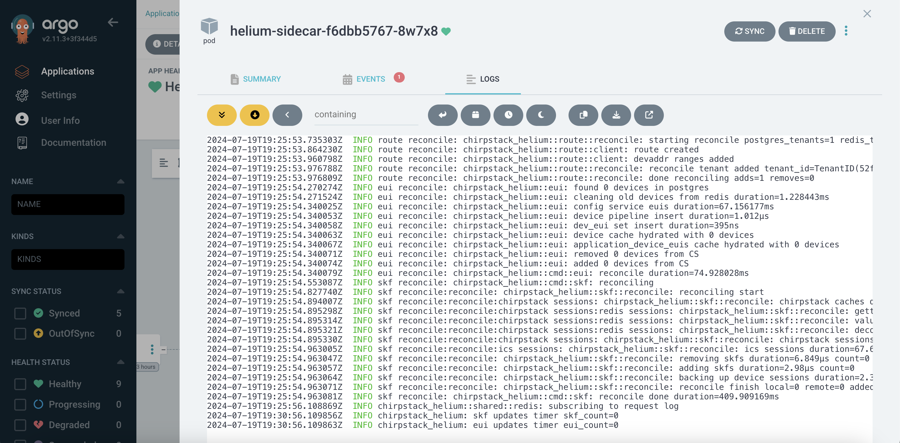
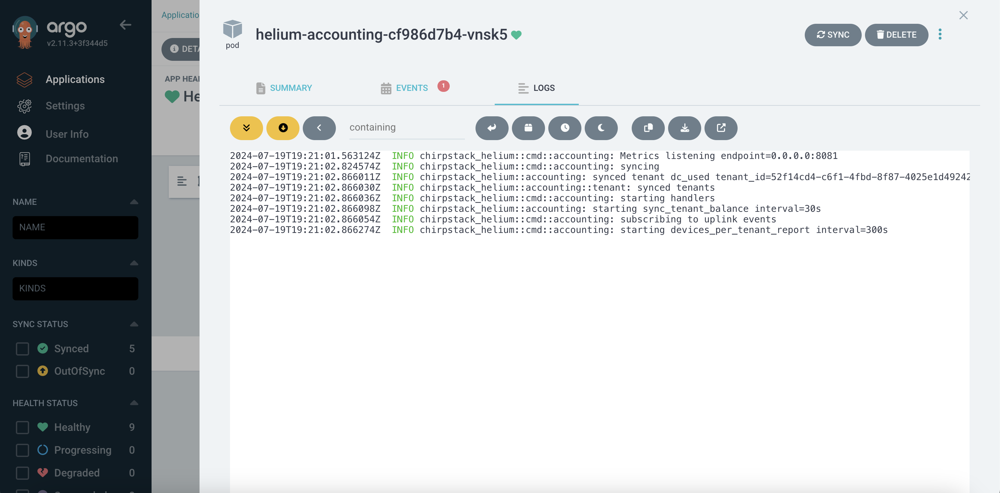

# Helium

This directory contains a set of Helm charts for deploying the Helium sidecar applications in the EKS cluster. In particular, this directory includes Helm charts for:

- Helium Accounting: Tracks uplinks and Helium DC consumption for Chirpstack Tenants.
- Helium Sidecar: Updates the [Helium IoT Config Service](https://docs.helium.com/iot/run-an-lns#high-level-architecture) based on devices added to Chirpstack

## Usage

Getting the Helium application happy is the last remaining hurdle to completing the deployment, but with a few minor configuration updates it'll be good to go.

### Prerequisites

1. Create plaintext AWS Secret Manager secret comprising base64 encoded Helium Delegate Keypair
  a. On local device, locate Helium Delegate Keypair
  b. Base64 encode the Helium Delegate Keypair. On OSX, this can be done by running `openssl base64 -in <keypair_binary_file> -out keypair.txt`
  c. Create a plaintext Secrets Manager secret titled `chirpstack/helium-keypair` with the contents of `keypair.txt`
2. Update admin password in Chirpstack
  a. Navigate to Chirpstack in your browser at <chirpstack.example.com> (where <chirpstack.example.com> is replaced with the domain provided via the `chirpstack.host` attributed in `./chirpstack/value.yaml`)
  b. Log in with the default username: `admin`, password: `admin` credentials
  c. Select the user dropdown in the upper right hand portion of the page, as shown in the red box in the image below, and click "Change password".
  d. Provide the password titled `root/chirpstack-admin-credentials` stored in Secrets Manager

3. Create Chirpstack API key for Helium use
  a. While still logged into Chirpstack, select the "API Keys" tab under the "Network Sever" section header, as shown in the red box in the image below. Then, select "Add API key" as shown in the second red box
  b. Make a note of the API key as it will be used in configuring the Helium `settings.toml` file described in step 4

4. Create `settings.toml` file
  a. Make a local, out-of-repo copy of `./helium/files/settings.toml`.  **Do not commit this file!**
  b. Update local copy `settings.toml` with values and configuration for the deployment.
  c. Create a plaintext Secrets Manager secret titled `chirpstack/helium-settings` with the contents of `settings.toml`
  d. Again, **do not commit the `settings.toml` file!**

### Deployment

1. `git commit` the changes to `values.yaml`. Argo will catch these changes and update the cluster.

### Postrequisites

Everything is now in order for the Helium application to be happily deployed, but it will take some further massaging to get there.

1. Log into Argo.
2. Click the Helium application, as shown in the red box in the image below. It might look "happy" but it's lying to you :D

3. Click the refresh button, as shown in the red circle in the image below, to ensure the latest commit is deployed from the forked Git Repo.

4. Force new `helium-sidecar` and `helium-accounting` ReplicaSets by clicking the three vertical dots in the respective `helium-sidecar` and `helium-accounting` ReplicaSets groupings and selecting delete, as shown in the red box in the image below. After doing so, new `helium-sidecar` and `helium-accounting` ReplicaSets will be created.

5. Confirm operating state of the `helium-sidecar` and `helium-accounting` pods by checking the logs in Argo. The logs should look similar to the ones shown in the images below. 

In the `helium-sidecar` logs, expect to see a stream of "INFO chirpstack_helium: skf updates timer skf_count=0, INFO chirpstack_helium: eui updates timer eui_count=0" logs.

In the `helium-accounting` logs, expect to "INFO chirpstack_helium::cmd::accounting: starting devices_per_tenant_report interval=300s" as the last log.

### Post Deployment Notes

At this point, the Helium application will be healthy. You can now start configuring LoRaWAN devices in Chirpstack and they will be automatically synced to the Helium Network.
